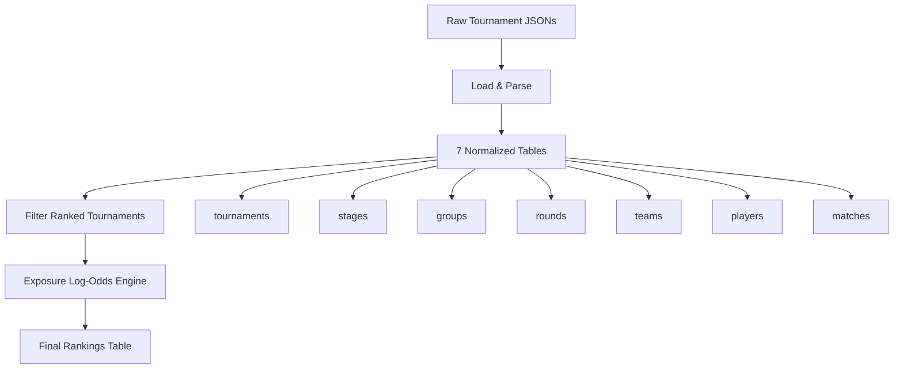

# Tournament Ranking System Data Schemas

This document describes the data schemas for the tables generated as part of the tournament ranking system.

## Overview

The tournament ranking system processes tournament data from scraped JSON files and produces several relational tables that capture tournament structure, match results, and player rankings. The data flows from raw tournament files through parsing stages to produce normalized tables and ultimately calculated rankings.

## Source Data Tables

### 1. TOURNAMENTS Table
**Description**: Master table containing tournament-level metadata and settings.

**Shape**: ~1,972 rows × 48 columns

| Column | Type | Description |
|--------|------|-------------|
| `tournament_id` | Int64 | Unique identifier for the tournament |
| `event_id` | Int64 | Associated event identifier |
| `name` | String | Tournament name |
| `description` | String | Tournament description text |
| `start_time` | Int64 | Unix timestamp of tournament start |
| `is_finalized` | Int64 | Whether tournament is completed (0/1) |
| `parent_tournament_id` | Int64 | ID of parent tournament if part of series |
| `discord_url` | String | Discord server URL |
| `logo_url` | String | Tournament logo URL |
| `logo_validated_at` | Int64 | Logo validation timestamp |
| `logo_src` | String | Logo source |
| `map_picking_style` | String | Map selection method |
| `rules` | String | Tournament rules text |
| `tags` | List(String) | Tournament tags/categories |
| `cast_twitch_accounts` | List(String) | Twitch accounts casting matches |
| `org_id` | Int64 | Organization ID |
| `org_name` | String | Organization name |
| `org_slug` | String | Organization URL slug |
| `author_id` | Int64 | Tournament creator user ID |
| `author_username` | String | Tournament creator username |
| `author_discord_id` | String | Tournament creator Discord ID |
| `staff` | String | Staff information JSON |
| `staff_count` | Int64 | Number of staff members |
| `settings` | String | Tournament settings JSON |
| `settings_is_league` | Boolean | Whether tournament is a league format |
| `settings_is_ranked` | Boolean | Whether tournament counts for rankings |
| `settings_enable_no_screen` | Boolean | No-screen setting enabled |
| `settings_autonomous_subs` | Boolean | Automatic substitution enabled |
| `settings_registration_cap` | Int64 | Maximum team registrations |
| `settings_min_members_per_team` | Int64 | Minimum players per team |
| `sub_count_plus_one` | Int64 | Plus One tier substitutions count |
| `sub_count_plus_two` | Int64 | Plus Two tier substitutions count |
| `casted_matches_count` | Int64 | Number of casted matches |
| `casted_matches_info` | String | Casted matches metadata |
| `tie_breaker_map_pool` | String | Tiebreaker map pool |
| `to_set_map_pool` | String | To-set map pool |
| `bracket_progression_overrides` | String | Custom bracket progression rules |
| `participated_users_count` | Int64 | Total participating users |
| `team_count` | Int64 | Number of teams |
| `match_count` | Int64 | Number of matches |
| `stage_count` | Int64 | Number of stages |
| `group_count` | Int64 | Number of groups |
| `round_count` | Int64 | Number of rounds |

### 2. STAGES Table
**Description**: Tournament stage configuration (e.g., round-robin, double elimination).

**Shape**: ~3,387 rows × 13 columns

| Column | Type | Description |
|--------|------|-------------|
| `tournament_id` | Int64 | Tournament identifier (foreign key) |
| `stage_id` | Int64 | Unique stage identifier |
| `stage_name` | String | Stage name (e.g., "Group Stage", "Playoffs") |
| `stage_number` | Int64 | Stage sequence number |
| `stage_type` | String | Stage format type |
| `setting_grandFinal` | String | Grand final format settings |
| `setting_matchesChildCount` | Int64 | Number of child matches |
| `setting_size` | Int64 | Stage size (number of participants) |
| `setting_seedOrdering` | List(String) | Seed ordering method |
| `setting_consolationFinal` | Boolean | Whether consolation final exists |
| `setting_groupCount` | Int64 | Number of groups in stage |
| `setting_roundRobinMode` | String | Round-robin mode if applicable |
| `setting_swiss` | Struct | Swiss tournament settings (groupCount, roundCount) |

### 3. GROUPS Table
**Description**: Groups within tournament stages.

**Shape**: ~9,441 rows × 4 columns

| Column | Type | Description |
|--------|------|-------------|
| `tournament_id` | Int64 | Tournament identifier (foreign key) |
| `stage_id` | Int64 | Stage identifier (foreign key) |
| `group_id` | Int64 | Unique group identifier |
| `group_number` | Int64 | Group sequence number |

### 4. ROUNDS Table
**Description**: Rounds within groups/stages.

**Shape**: ~28,326 rows × 7 columns

| Column | Type | Description |
|--------|------|-------------|
| `tournament_id` | Int64 | Tournament identifier (foreign key) |
| `stage_id` | Int64 | Stage identifier (foreign key) |
| `group_id` | Int64 | Group identifier (foreign key) |
| `round_id` | Int64 | Unique round identifier |
| `round_number` | Int64 | Round sequence number |
| `maps_count` | Int64 | Number of maps in round |
| `maps_type` | String | Map selection type |

### 5. TEAMS Table
**Description**: Team registrations for tournaments.

**Shape**: ~31,644 rows × 9 columns

| Column | Type | Description |
|--------|------|-------------|
| `tournament_id` | Int64 | Tournament identifier (foreign key) |
| `team_id` | Int64 | Unique team identifier |
| `team_name` | String | Team name |
| `seed` | Int64 | Team seed/ranking |
| `prefers_not_to_host` | Boolean | Host preference flag |
| `no_screen` | Boolean | No-screen mode flag |
| `dropped_out` | Boolean | Whether team dropped out |
| `invite_code` | Null | Team invite code (unused) |
| `created_at` | Int64 | Team creation timestamp |

### 6. PLAYERS Table
**Description**: Player roster information for teams.

**Shape**: ~118,222 rows × 10 columns

| Column | Type | Description |
|--------|------|-------------|
| `tournament_id` | Int64 | Tournament identifier (foreign key) |
| `team_id` | Int64 | Team identifier (foreign key) |
| `user_id` | Int64 | Unique user/player identifier |
| `username` | String | Player username |
| `discord_id` | String | Player Discord ID |
| `in_game_name` | String | In-game player name |
| `country` | String | Player country code |
| `twitch` | String | Player Twitch username |
| `is_owner` | Boolean | Whether player is team captain |
| `roster_created_at` | Int64 | Roster addition timestamp |

### 7. MATCHES Table
**Description**: Match results and metadata.

**Shape**: ~75,319 rows × 22 columns

| Column | Type | Description |
|--------|------|-------------|
| `tournament_id` | Int64 | Tournament identifier (foreign key) |
| `stage_id` | Int64 | Stage identifier (foreign key) |
| `group_id` | Int64 | Group identifier (foreign key) |
| `round_id` | Int64 | Round identifier (foreign key) |
| `match_id` | Int64 | Unique match identifier |
| `match_number` | Int64 | Match sequence number |
| `status` | Int64 | Match status code |
| `last_game_finished_at` | Int64 | Timestamp of last game completion |
| `match_created_at` | Int64 | Match creation timestamp |
| `team1_id` | Int64 | First team identifier |
| `team1_position` | Int64 | First team bracket position |
| `team1_score` | Int64 | First team score |
| `team1_result` | String | First team result (win/loss/draw) |
| `team2_id` | Int64 | Second team identifier |
| `team2_position` | Int64 | Second team bracket position |
| `team2_score` | Int64 | Second team score |
| `team2_result` | String | Second team result (win/loss/draw) |
| `winner_team_id` | Int64 | Winning team identifier |
| `loser_team_id` | Int64 | Losing team identifier |
| `score_diff` | Int64 | Score differential |
| `total_games` | Int64 | Total games played in match |
| `is_bye` | Boolean | Whether match is a bye |

## Derived Tables

### FINAL RANKINGS Table
**Description**: Calculated player rankings using the Exposure Log-Odds algorithm.

**Shape**: ~2,992 rows × 12 columns

| Column | Type | Description |
|--------|------|-------------|
| `rank` | Int64 | Player rank position (1 = highest) |
| `rank_label` | String | Rank tier label (X+, X, S+, S, S-, A+, A, A-, B+, B, B-) |
| `username` | String | Player username |
| `player_id` | Int64 | Unique player identifier |
| `display_score` | Float64 | Normalized display score (0-100 scale) |
| `exposure` | Float64 | Player exposure metric (PageRank-based activity measure) |
| `win_pr` | Float64 | Win PageRank score |
| `loss_pr` | Float64 | Loss PageRank score |
| `score` | Float64 | Raw ranking score (log-odds ratio) |
| `win_loss_ratio` | Float64 | Win/loss PageRank ratio |
| `tournament_count` | Int64 | Number of tournaments played |
| `last_active` | Int64 | Unix timestamp of last tournament participation |

## Data Processing Pipeline



## Key Relationships

1. **Tournament Hierarchy**: 
   - Tournaments contain Stages
   - Stages contain Groups
   - Groups contain Rounds
   - Rounds contain Matches

2. **Team/Player Structure**:
   - Teams participate in Tournaments
   - Players belong to Teams for specific Tournaments
   - Players can be on different Teams across Tournaments

3. **Match Results**:
   - Matches involve two Teams
   - Matches produce winner/loser outcomes
   - Match scores determine tournament progression

## Ranking Algorithm Notes

The **Exposure Log-Odds Engine** uses:
- Dual PageRank approach to remove volume bias
- Log-ratio of win/loss PageRank with same exposure baseline
- Auto-tuning lambda smoothing parameter
- Optional surprisal weighting for upsets
- Minimum exposure filtering
- Tick-tock algorithm for active player detection

## Data Quality Considerations

- **Ranked Tournaments**: Only ~30.6% of tournaments are ranked (603 out of 1,972)
- **Ranked Matches**: ~43.5% of all matches are in ranked tournaments
- **Active Players**: ~5,386 players meet minimum activity thresholds
- **Final Rankings**: ~2,992 players included after post-processing filters

## Usage Examples

```python
# Load tournament data
tournaments = load_scraped_tournaments("data/tournaments")
tables = parse_tournaments_data(tournaments)

# Filter to ranked tournaments only
from rankings.analysis.utils.tournament_filters import filter_ranked_tournaments
ranked_tables = filter_ranked_tournaments(tables)

# Run ranking algorithm
from rankings.algorithms import ExposureLogOddsEngine
from rankings.core import ExposureLogOddsConfig

config = ExposureLogOddsConfig()
engine = ExposureLogOddsEngine(config)
rankings = engine.rank_players(
    ranked_tables["matches"], 
    ranked_tables["players"]
)

# Post-process rankings
from rankings.postprocess import post_process_rankings
final_rankings = post_process_rankings(
    rankings=rankings,
    players_df=ranked_tables["players"],
    min_tournaments=3,
    score_multiplier=25.0,
    tournaments_df=ranked_tables["tournaments"]
)
```