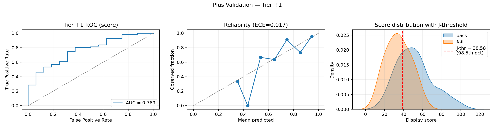
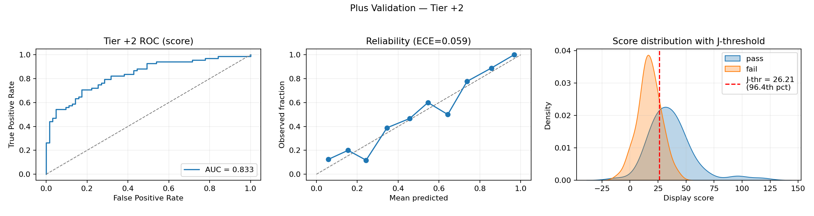
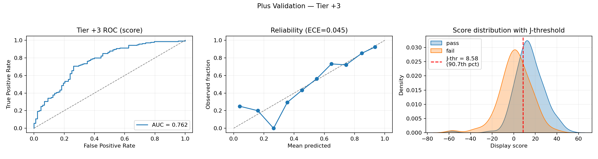

# Plus Server Validation — Outcomes‑Only Rankings vs. Peer Voting

This report evaluates how well an outcomes‑only ranking signal aligns with community Plus‑server votes. We present methods, results with confidence intervals, calibration and thresholds, stratified analyses, and limitations. No player names are disclosed.

---

## Executive Summary

- Strong alignment overall. The ranking separates passes from fails with AUC = 0.742 (95% CI 0.693–0.789) across all tiers combined.
- By tier: +2 shows the strongest agreement (AUC = 0.847), +1 is good but noisier (0.769), +3 is strong given its heterogeneity (0.798).
- Active‑only filter helps. Limiting to players active within 90 days improves stability and agreement.
- Thresholds exist but should be used cautiously. We provide Youden‑J operating points per tier to summarize where pass/fail separation is clearest; calibration quality varies by tier and sample size.

---

## What Are the Plus Servers?

Community‑run, invite‑only “Plus” servers where entrants are evaluated by peers at three tiers:

- +1: highly skilled; often selective or semi‑retired.  
- +2: very strong and typically active.  
- +3: strong with broader, more heterogeneous membership.

Voting is independent of the ranking model and reflects human judgements of latent skill; it can be influenced by recency, reputation, and participation.

---

## Objective

Test how well a bottom‑up, outcomes‑only ranking (Exposure‑prior log‑odds from Win/Loss PageRanks with iterative event‑strength) agrees with Plus voting.  
Primary metric: ROC AUC with 95% bootstrap CIs, overall and per tier. We also report macro AUCs (unweighted and sample‑weighted).

---

## Data & Filters

- Source: Scraped ranked tournaments from `sendou.ink` with minimum size criteria.  
- Temporal freeze: only tournaments with `start_time < 2025‑08‑17 00:00:00 UTC` (i.e., up to 2025‑08‑16 UTC) to prevent leakage.  
- Active‑only: exclude players whose `last_active` is > 90 days before cutoff.  
- Plus voting file: scraped from `sendou.ink`.
- Match rate: 424 / 511 voting rows matched to rankings (≈83.0%). The unmatched set is held out of analysis.

---

## Ranking Configuration

- Recency: half‑life 180 days; exponential time decay.  
- Graph metric: log‑odds of Win vs. Loss PageRanks with exposure‑based teleportation.  
- Event strength (“tick‑tock”): iterative tournament influence via log of top‑20 participants’ scores; tolerance 0.01; up to 5 ticks per pass.  
- Inactivity score decay: starts after 180 days; mild rate 0.01.  
- Post‑processing: no inactivity drop; `min_tournaments = 0`.  
- Display: `display_score = 25 × score`.

---

## Method Summary

1. Parse tournaments → filter ranked → apply cutoff.  
2. Compute rankings under the fixed configuration.  
3. Join to Plus votes by player id.  
4. Apply active‑only ≤ 90 days filter.  
5. Compute overall (micro) AUC and per‑tier AUCs; report macro AUCs (unweighted mean across tiers and a sample‑weighted mean).  
6. Derive 95% CIs via bootstrap and tier‑specific calibration (Platt scaling) for thresholds.

---

## Main Results (active‑only ≤ 90 days)

- Matched votes: 424 of 511  
- Overall AUC (micro): 0.7424 (95% CI 0.693–0.789)  
- Macro AUC (unweighted): 0.8045 (95% CI 0.752–0.851)  
- Macro AUC (sample‑weighted): 0.8075 (95% CI 0.762–0.849)

Per tier:

| Tier | AUC | 95% CI | n |
|---|---:|:---:|---:|
| +1 | 0.7690 | 0.634–0.885 | 72 |
| +2 | 0.8469 | 0.782–0.909 | 127 |
| +3 | 0.7977 | 0.734–0.854 | 225 |

Interpretation: Agreement is strong across tiers, especially +2. Filtering out long‑inactive players improves stability and alignment.

---

## Visualizations

The following panels show, per tier, the ROC curve (using the score as the predictor), a reliability plot with ECE, and the score distribution by pass/fail with the Youden‑J score threshold overlaid and annotated with its percentile among all ranked players.

### How To Read The Panels

- ROC: Blue curve vs. gray diagonal (chance). AUC in the legend; higher AUC means better pass/fail separation by the score at all cutoffs.
- Reliability: Dots are binned mean predicted probability vs. observed pass rate; the dashed 45° line is perfect calibration. ECE summarizes the average weighted gap; lower is better.
- Score distribution: KDEs for pass (blue) and fail (orange). Red dashed vertical line is the Youden‑J score threshold; the label shows its percentile among all ranked players (e.g., 98.5% means 98.5% of all ranked players have scores at or below that line).

### Tier Notes

- +1: AUC ≈ 0.769; ECE ≈ 0.017 (well‑calibrated). J‑threshold ≈ 38.6, at the ≈98.5th percentile globally — only the very top of the overall ranked pool exceed it.
- +2: AUC ≈ 0.847; ECE ≈ 0.075. J‑threshold ≈ 26.1, ≈96.8th percentile globally — clear separation with a high but less extreme cutoff than +1.
- +3: AUC ≈ 0.798; ECE ≈ 0.097. J‑threshold ≈ 7.0, ≈90.6th percentile globally — distributions overlap more than +2, consistent with a broader, heterogeneous pool.

---

## Behavioral Interpretation by Tier (Hypotheses)

- +1 (lower AUC): includes selective/semi‑retired talent; votes may reflect reputation and sporadic activity, increasing mismatch with outcomes‑only signals.  
- +2 (highest AUC): selective and engaged; outcomes capture current form well, so votes and rankings align strongly.  
- +3 (good AUC, more noise): larger, heterogeneous pool; greater variance in recency and consistency; alignment remains strong.

---

## Stratified Evidence (active‑only ≤ 90 days)

By recency (days since last active):  
- +1: 0–30d ≈ 0.79; older slices sparse or lower (small N).  
- +2: strong across buckets; best at 0–30d ≈ 0.86.  
- +3: solid at 0–30d ≈ 0.81; more volatility at 61–90d (small N).

By participation (unique tournaments in last 90d):  
- +1: AUC rises with participation (3+ ≈ 0.82; 1–2 tiny N).  
- +2: high in both 1–2 and 3+ (≈ 0.84–0.89).  
- +3: 3+ ≈ 0.81; 1–2 ≈ 0.70 (noisier at lower volume).

---

## Calibration & Thresholds (Youden’s J)

We fit Platt scaling per tier (logistic map from `display_score` → P(pass)), compute ECE (10 bins), and report Youden‑J optimal thresholds. We also include the score‑threshold percentile: the fraction of all ranked players whose display score is at or below the J‑threshold.

| Tier | ECE | J‑prob threshold (95% CI) | Score threshold (95% CI) | Score threshold percentile |
|---|---:|:---|:---|:---:|
| +1 | ≈ 0.017 | 0.732 (0.590–0.916) | 38.6 (29.4–53.2) | 98.5% |
| +2 | ≈ 0.075 | 0.658 (0.294–0.764) | 26.1 (16.1–29.4) | 96.8% |
| +3 | ≈ 0.097 | 0.646 (0.420–0.731) | 7.0 (−4.0–10.2) | 90.6% |

### What Is Youden’s J?

- Definition: `J(threshold) = TPR(threshold) + TNR(threshold) − 1 = TPR − FPR`.
- Interpretation: Maximizes the vertical distance between the ROC curve and the chance line; equivalent to maximizing balanced accuracy `((TPR + TNR)/2)`.
- Why we use it: Provides a single, prevalence‑agnostic operating point that balances sensitivity and specificity when costs are symmetric.
- How we compute it here:
  - Fit Platt scaling per tier to map `display_score → P(pass)`.
  - Compute ROC on both calibrated probability and raw score.
  - Choose the threshold that maximizes `TPR − FPR` in each domain.
  - Report 95% bootstrap CIs by resampling players within a tier and refitting the calibration each replicate.
- Caveats: If costs are asymmetric (e.g., prefer higher recall), another operating point may be better. Small sample sizes can make J unstable; see the confidence intervals and ECE for context.

Note: Thresholds summarize where separation is sharpest within each tier; use for triage, not as hard gates. Calibration quality varies by tier and sample size.

---

## Error Analysis (No Names)

- Definitions:  
  - Type I (False Positive): vote = fail, but score above that tier’s J‑threshold.  
  - Type II (False Negative): vote = pass, but score below that tier’s J‑threshold.

- Procedure: We maintain anonymized candidate lists internally. For each mismatch we run a leave‑one‑match‑out analysis to identify high‑influence recent results (e.g., a small number of decisive wins/losses near the cutoff).

---

## Limitations

- Voting is a noisy proxy of latent skill (reputation, varying engagement). Active‑only filtering reduces—but does not remove—these effects.  
- Cross‑tier J‑thresholds differ; micro AUC is less comparable than macro AUC. Small‑N slices widen uncertainty.  
- This is a single time‑slice. Pre‑vote snapshots and rolling windows would further test temporal robustness.

---

- Temporal holdout: pre‑vote snapshots and rolling AUC curves.
- Confidence intervals in all stratified slices; suppress tiny cohorts.
- Tier‑normalized “combined” predictor (z‑scores or delta‑to‑median) to make cross‑tier micro AUC fair.
- Baselines: naive recent‑winrate and simpler models for context.
- Repro UX: add CLI flags and JSON summaries for automated pipelines.
