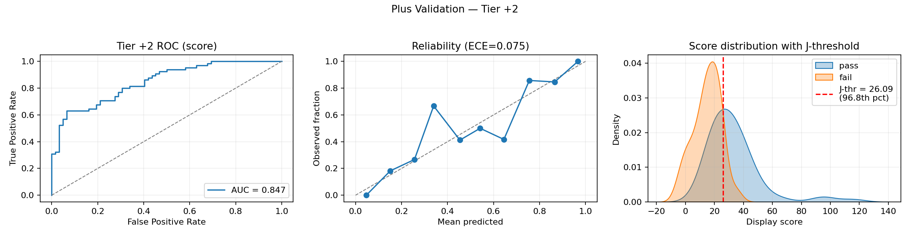
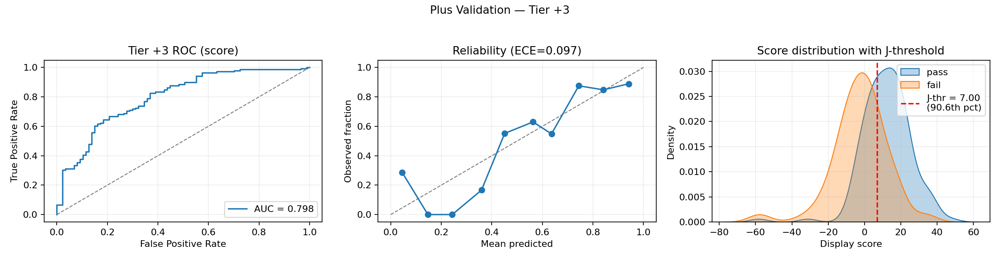

# Plus Server Validation — Outcomes‑Only Rankings vs. Peer Voting (with OpenSkill baseline)

This report evaluates how well an outcomes‑only ranking signal aligns with community Plus‑server votes. We present methods, results with confidence intervals, calibration and thresholds, stratified analyses, and limitations. No player names are disclosed.

---

## Executive Summary

- Across tiers, agreement is strong: macro AUC = 0.781 (95% CI 0.729–0.830) and sample‑weighted macro AUC = 0.781 (95% CI 0.736–0.824).
- Micro AUC (all tiers pooled) = 0.728 (95% CI 0.681–0.775).
- By tier: +2 is strongest (AUC = 0.833), +3 is solid (0.762), +1 is noisier (0.749).
- OpenSkill baseline is lower on the same active‑only window: ordinal AUC = 0.610 (95% CI 0.555–0.656) and μ AUC = 0.634 (95% CI 0.582–0.681) on the subset with OpenSkill coverage (n = 431). On the intersection set, we compare macro AUC only; LOOPR exceeds OpenSkill by ΔAUC ≈ +0.184 (ordinal) and +0.153 (μ).
- Activity‑only baselines underperform: tournaments_90d AUC = 0.437, matches_90d AUC = 0.476, winrate_90d AUC = 0.602.
- Active‑only filter helps. Limiting to players active within 90 days improves stability and agreement.
- Thresholds exist but should be used cautiously. We provide Youden‑J operating points per tier to summarize where pass/fail separation is clearest; calibration quality varies by tier and sample size.

---

## What Are the Plus Servers?

Community‑run, invite‑only “Plus” servers where entrants are evaluated by peers at three tiers:

- +1: highly skilled; often selective or semi‑retired.  
- +2: very strong and typically active.  
- +3: strong with broader, more heterogeneous membership.

Voting is independent of the ranking model and reflects human judgements of latent skill; it can be influenced by recency, reputation, and participation.
Each row in the voting dataset represents a nominated candidate within a tier; pass/fail is the vote outcome for that tier’s candidate pool (pass = ≥60% of votes).

---

## Objective

Test how well a bottom‑up, outcomes‑only ranking (LOOPR: exposure‑prior log‑odds from Win/Loss PageRanks with iterative event‑strength) agrees with Plus voting, and compare against OpenSkill baselines (ordinal and μ).  
Primary metric: ROC AUC with 95% bootstrap CIs, overall and per tier. We also report macro AUCs (unweighted and sample‑weighted).

---

## Data & Filters

- Source: Scraped ranked tournaments from `sendou.ink` with minimum size criteria.  
- Temporal freeze: only tournaments with `start_time < 2025‑08‑17 00:00:00 UTC` (i.e., up to 2025‑08‑16 UTC) to prevent leakage.  
- Decay clock: rankings are computed with `now_ts = cutoff_ts` so time‑decay and tick‑tock active sets are anchored to the snapshot (prevents drift across reruns).  
- Active‑only: exclude players whose `last_active` is > 90 days before cutoff.  
- Plus voting file: scraped from `sendou.ink`.
- OpenSkill ratings file: `data/openskill_ratings.parquet` (μ, σ, ordinal).  
- Match rate (active‑only): 432 / 511 voting rows matched to LOOPR rankings (≈84.5%). The unmatched set is held out of analysis.  
- OpenSkill coverage: 431 active‑only voting rows matched to OpenSkill (tiers: +1 n=73, +2 n=130, +3 n=228).

---

## LOOPR Configuration

- Recency: half‑life 180 days; exponential time decay.  
- Graph metric: log‑odds of Win vs. Loss PageRanks with exposure‑based teleportation.  
- Event strength (“tick‑tock”): iterative tournament influence via log of top‑20 participants’ scores; tolerance 0.01; up to 5 ticks per pass.  
- Inactivity score decay: starts after 180 days; mild rate 0.01.  
- Post‑processing: no inactivity drop; `min_tournaments = 0`.  
- Display: `display_score = 25 × score`.
  - Note: score decay is applied inside the engine; we do not drop or downrank players solely for inactivity beyond the active‑only evaluation filter.

## OpenSkill Baseline

- Predictor: OpenSkill ordinal (μ − 3σ) and μ.  
- No additional calibration; we evaluate raw scores for AUC comparability.  
- Active‑only and temporal cutoff are the same as the LOOPR evaluation; OpenSkill coverage differs slightly due to rating availability.

---

## Method Summary

1. Parse tournaments → filter ranked → apply cutoff.  
2. Compute rankings under the fixed configuration with the decay clock anchored to the cutoff timestamp.  
3. Join to Plus votes by player id.  
4. Apply active‑only ≤ 90 days filter.  
5. Compute LOOPR overall (micro) AUC and per‑tier AUCs; report macro AUCs (unweighted mean across tiers and a sample‑weighted mean).  
6. Join the active‑only set to OpenSkill ratings (ordinal and μ) and compute AUCs for the covered subset.  
7. Compute activity‑only baselines (tournaments_90d, matches_90d, winrate_90d) and compare AUCs.  
8. Derive 95% CIs via bootstrap and tier‑specific calibration (Platt scaling) for thresholds.

---

## LOOPR Results (active‑only ≤ 90 days)

- Matched votes: 432 of 511  
- Overall AUC (micro): 0.728 (95% CI 0.681–0.775)  
- Macro AUC (unweighted): 0.781 (95% CI 0.729–0.830)  
- Macro AUC (sample‑weighted): 0.781 (95% CI 0.736–0.824)

Per tier:

| Tier | AUC | 95% CI | n |
|---|---:|:---:|---:|
| +1 | 0.7489 | 0.617–0.864 | 73 |
| +2 | 0.8331 | 0.757–0.898 | 131 |
| +3 | 0.7620 | 0.696–0.825 | 228 |

Interpretation: Agreement is strong across tiers, especially +2. Filtering out long‑inactive players improves stability and alignment.

### OpenSkill Baseline (active‑only ≤ 90 days)

OpenSkill scores show weaker alignment with Plus voting on the same active‑only window. We report both ordinal (μ − 3σ) and μ; n reflects OpenSkill coverage.

**Overall AUC (OpenSkill coverage n=431):**
- Ordinal: 0.610 (95% CI 0.555–0.656)  
- μ: 0.634 (95% CI 0.582–0.681)

Per tier:

| Tier | Ordinal AUC (95% CI) | μ AUC (95% CI) | n |
|---|---:|---:|---:|
| +1 | 0.579 (0.437–0.724) | 0.645 (0.503–0.785) | 73 |
| +2 | 0.599 (0.493–0.693) | 0.608 (0.503–0.705) | 130 |
| +3 | 0.615 (0.550–0.684) | 0.632 (0.563–0.700) | 228 |

Interpretation: OpenSkill μ is modestly stronger than ordinal, but both lag LOOPR on this validation set.

### Paired Comparison on the Intersection Set (Macro AUC Only)

To avoid coverage differences and avoid cross‑tier pooling, we compare all methods on the intersection of active‑only rows with both LOOPR and OpenSkill ratings (n = 431) using unweighted macro AUC across tiers.

- LOOPR macro AUC (intersection): 0.781 (95% CI 0.731–0.832)  
- OpenSkill ordinal macro AUC: 0.598 (95% CI 0.536–0.656)  
- OpenSkill μ macro AUC: 0.628 (95% CI 0.569–0.686)  
- ΔAUC (LOOPR − OpenSkill ordinal, macro): +0.184 (median), 95% CI [0.117, 0.252]  
- ΔAUC (LOOPR − OpenSkill μ, macro): +0.153 (median), 95% CI [0.085, 0.219]

### Activity‑Only Baselines (last 90 days)

These baselines use the same active‑only voting rows and compute activity features in the 90‑day window before cutoff (roster‑based match counts).

| Baseline | AUC | n |
|---|---:|---:|
| Tournaments_90d | 0.437 | 432 |
| Matches_90d | 0.476 | 431 |
| Winrate_90d | 0.602 | 431 |

---

## Visualizations

The following panels visualize LOOPR only (OpenSkill baseline is reported numerically above). Each panel shows, per tier, the ROC curve (using the score as the predictor), a reliability plot with ECE, and the score distribution by pass/fail with the Youden‑J score threshold overlaid and annotated with its percentile among all ranked players.

### How To Read The Panels

- ROC: Blue curve vs. gray diagonal (chance). AUC in the legend; higher AUC means better pass/fail separation by the score at all cutoffs.
- Reliability: Dots are binned mean predicted probability vs. observed pass rate; the dashed 45° line is perfect calibration. ECE summarizes the average weighted gap; lower is better.
- Score distribution: KDEs for pass (blue) and fail (orange). Red dashed vertical line is the Youden‑J score threshold; the label shows its percentile among all ranked players (e.g., 98.5% means 98.5% of all ranked players have scores at or below that line).

### Tier Notes

- +1: AUC ≈ 0.749; ECE ≈ 0.024. J‑threshold ≈ 52.2, at the ≈99.1st percentile globally — only the very top of the overall ranked pool exceed it.
- +2: AUC ≈ 0.833; ECE ≈ 0.059. J‑threshold ≈ 26.2, ≈96.4th percentile globally — clear separation with a high but less extreme cutoff than +1.
- +3: AUC ≈ 0.762; ECE ≈ 0.045. J‑threshold ≈ 8.6, ≈90.7th percentile globally — distributions overlap more than +2, consistent with a broader, heterogeneous pool.

---

## Behavioral Interpretation by Tier (Hypotheses)

- +1 (lower AUC): includes selective/semi‑retired talent; votes may reflect reputation and sporadic activity, increasing mismatch with outcomes‑only signals.  
- +2 (highest AUC): selective and engaged; outcomes capture current form well, so votes and rankings align strongly.  
- +3 (good AUC, more noise): larger, heterogeneous pool; greater variance in recency and consistency; alignment remains strong.

---

## Stratified Evidence (active‑only ≤ 90 days)

By recency (days since last active):  
- +1: 0–30d ≈ 0.79; 31–60d drops (≈ 0.17) with very small N; 61–90d too small to estimate.  
- +2: 0–30d ≈ 0.83; older buckets are high but tiny N (n=4–9).  
- +3: 0–30d ≈ 0.77; 31–60d ≈ 0.54; 61–90d tiny N (n=8), high variance.

By participation (unique tournaments in last 90d):  
- +1: 3+ ≈ 0.82; 1–2 is perfect but tiny N (n=14).  
- +2: strong in both 1–2 (≈ 0.86) and 3+ (≈ 0.83).  
- +3: 3+ ≈ 0.79; 1–2 drops to ≈ 0.39 (n=31), indicating higher noise at low volume.

---

## Calibration & Thresholds (Youden’s J)

We fit Platt scaling per tier (logistic map from `display_score` → P(pass)), compute ECE (10 bins), and report Youden‑J optimal thresholds. We also include the score‑threshold percentile: the fraction of all ranked players whose display score is at or below the J‑threshold.

| Tier | ECE | J‑prob threshold (95% CI) | Score threshold (95% CI) | Score threshold percentile |
|---|---:|:---|:---|:---:|
| +1 | ≈ 0.024 | 0.844 (0.594–0.916) | 52.2 (32.3–58.5) | 99.1% |
| +2 | ≈ 0.059 | 0.549 (0.332–0.742) | 26.2 (17.0–33.3) | 96.4% |
| +3 | ≈ 0.045 | 0.619 (0.461–0.680) | 8.6 (0.7–9.9) | 90.7% |

### What Is Youden’s J?

- Definition: `J(threshold) = TPR(threshold) + TNR(threshold) − 1 = TPR − FPR`.
- Interpretation: Maximizes the vertical distance between the ROC curve and the chance line; equivalent to maximizing balanced accuracy `((TPR + TNR)/2)`.
- Why we use it: Provides a single, prevalence‑agnostic operating point that balances sensitivity and specificity when costs are symmetric.
- How we compute it here:
  - Fit Platt scaling per tier to map `display_score → P(pass)`.
  - Compute ROC on both calibrated probability and raw score.
  - Choose the threshold that maximizes `TPR − FPR` in each domain.
  - Report 95% bootstrap CIs by resampling players within a tier and refitting the calibration each replicate.
- Caveats: If costs are asymmetric (e.g., prefer higher recall), another operating point may be better. Small sample sizes can make J unstable; see the confidence intervals and ECE for context.

Note: Thresholds summarize where separation is sharpest within each tier; use for triage, not as hard gates. Calibration quality varies by tier and sample size.

---

## Error Analysis (No Names)

- Definitions:  
  - Type I (False Positive): vote = fail, but score above that tier’s J‑threshold.  
  - Type II (False Negative): vote = pass, but score below that tier’s J‑threshold.

- Procedure: We maintain anonymized candidate lists internally. For each mismatch we run a leave‑one‑match‑out analysis to identify high‑influence recent results (e.g., a small number of decisive wins/losses near the cutoff).

---

## Limitations

- Voting is a noisy proxy of latent skill (reputation, varying engagement). Active‑only filtering reduces—but does not remove—these effects.  
- Cross‑tier J‑thresholds differ; micro AUC is less comparable than macro AUC. Small‑N slices widen uncertainty.  
- This is a single time‑slice. Pre‑vote snapshots and rolling windows would further test temporal robustness.
- Activity‑only baselines use roster‑based match attribution in the 90‑day window because appearance‑level match data is sparse before the cutoff.
- OpenSkill coverage is not identical to LOOPR’s matched set; baseline results use the active‑only subset with OpenSkill ratings.

---

- Temporal holdout: pre‑vote snapshots and rolling AUC curves.
- Confidence intervals in all stratified slices; suppress tiny cohorts.
- Tier‑normalized “combined” predictor (z‑scores or delta‑to‑median) to make cross‑tier micro AUC fair.
- Baselines: naive recent‑winrate and simpler models for context.
- Repro UX: add CLI flags and JSON summaries for automated pipelines.
